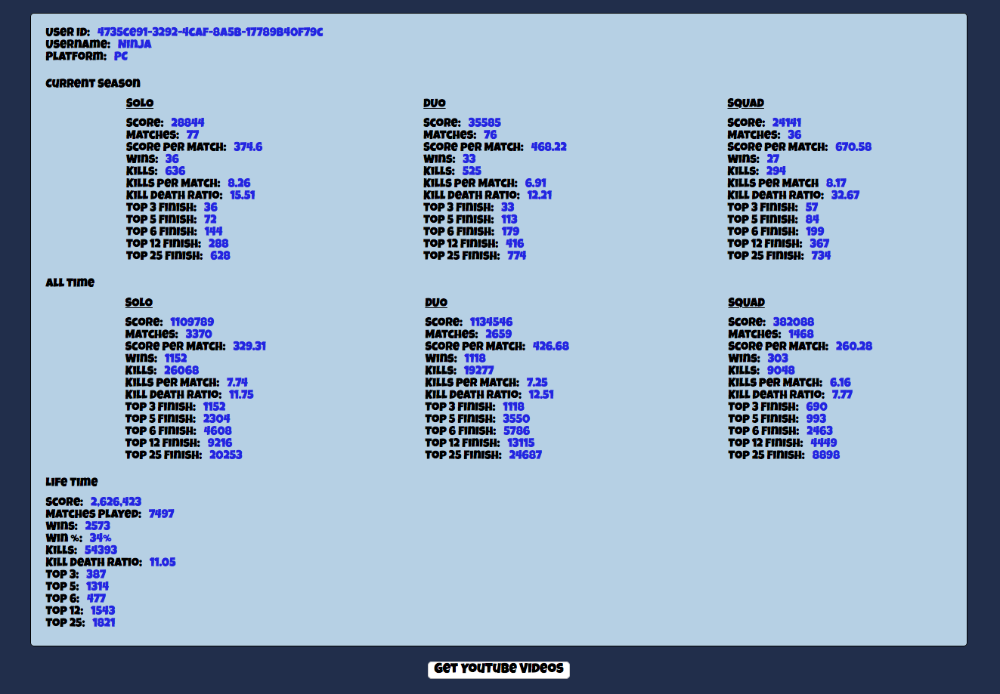

# FORTNITE Stat Tracker

[FORTNITE Stat Tracker][heroku]

[heroku]: https://fort-nite-stat-tracker.herokuapp.com/

FORTNITE Stat Tracker is a web application that utilizes the FORTNITE and YouTube APIs.  This site is designed to help players track their stats in game.  Users also have the ability to view the stats of their friends or even a popular streamer.  Certain streamer's videos can be found on the FORTNITE Stat Tracker, which utilizes the YouTube API to pull the 6 most current uploads.  The app was developed using Node.js on the backend and React on the front-end.

## Find Stats

If you play FORTNITE and have your own EPIC username, you can enter your username and platform to retrieve your stats.  If not, you can use the username: Ninja (A popular FORTNITE streamer) and platform: Computer.

## Stats

The retrieved stats show Current Season, All Time and Lifetime stats.  Current Season and All Time is broken up into Solo, Duo, or Squad stats (different game modes).  FORTNITE seasons are about 3 months in length.

## YouTube Videos

If you are a streamer, or you are looking at a streamer's stats, you can click the Get YouTube Video button.  These are Ninja's videos that are populated here.  This is currently a work in progress.  EPIC usernames and YouTube handles do not always match.  In the rare case that it does match, the button should populate the user's videos.  However, in Ninja's case, his username for FORTNITE is 'Ninja', while his username is 'NinjasHyper' on YouTube.  I am working on a fix for this, but in the meantime, I thought I would share that disclaimer.

